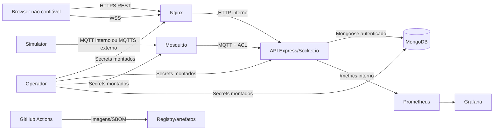

# Threat Model — IoT MQTT Simulator

**Status:** Baseline proposta para revisão humana  
**Data:** 2026-07-23  
**Método:** STRIDE + abuse cases  
**Escopo:** SPEC-006 / TASK-014

## 1. Objetivo

Identificar ativos, atores, limites de confiança e ameaças dos fluxos REST,
Socket.io, MQTT, persistência e pipeline antes da implementação do hardening.

## 2. Ativos

| ID | Ativo | Impacto se comprometido |
|---|---|---|
| AS-01 | Credenciais de operadores/viewers | Acesso não autorizado |
| AS-02 | Chave JWT e refresh sessions | Sequestro de sessão |
| AS-03 | Leituras industriais | Decisões operacionais incorretas |
| AS-04 | Alertas e estado de resolução | Ocultação de condição crítica |
| AS-05 | Credenciais e ACL MQTT | Injeção/interceptação de telemetria |
| AS-06 | MongoDB | Exposição, adulteração ou perda de histórico |
| AS-07 | Logs, métricas e dashboards | Vazamento e cegueira operacional |
| AS-08 | Imagens, lockfiles e pipeline | Comprometimento da supply chain |
| AS-09 | Certificados TLS | Interceptação e personificação |
| AS-10 | Disponibilidade da plataforma | Perda de monitoramento industrial |

## 3. Atores

| Ator | Confiança | Capacidades |
|---|---|---|
| Viewer autenticado | Parcial | Consultar telemetria e alertas |
| Operator autenticado | Parcial | Consultar e resolver alertas |
| Simulator | Parcial | Publicar nos tópicos autorizados |
| API | Alta dentro do processo | Consumir MQTT, persistir e transmitir |
| Operador de infraestrutura | Alta | Provisionar secrets e deploy |
| Cliente anônimo | Nenhuma | Alcançar endpoints públicos/Nginx |
| Atacante de rede | Nenhuma | Interceptar, repetir ou alterar tráfego |
| Dependência/artefato comprometido | Nenhuma | Executar código no build/runtime |

## 4. Trust boundaries e fluxos

### Boundaries

- **TB-01 Internet → Nginx:** entrada totalmente não confiável.
- **TB-02 Nginx → API:** proxy confiável único; headers encaminhados precisam
  ser sobrescritos, não aceitos do cliente.
- **TB-03 Browser → sessão:** JavaScript não é local seguro para refresh token.
- **TB-04 MQTT → API:** broker autentica cliente, mas payload continua não
  confiável.
- **TB-05 API → MongoDB:** credenciais e filtros precisam de mínimo privilégio.
- **TB-06 Observabilidade:** logs/métricas atravessam limite de confidencialidade.
- **TB-07 CI → artefato:** ações, dependências e imagens são código não confiável
  até verificação.

## 5. Ameaças STRIDE

| ID | Classe | Cenário | Impacto | Controle atual | Lacuna/controle planejado | Risco inicial |
|---|---|---|---|---|---|---|
| T-01 | Spoofing | Uso de credenciais default | Controle total | JWT básico | Remover defaults, Argon2id, secret file | Crítico |
| T-02 | Spoofing | Roubo de JWT do `localStorage` | Sequestro | Expiração 8h | Access em memória, refresh rotativo | Alto |
| T-03 | Spoofing | Handshake Socket.io anônimo | Telemetria sem autorização | CORS | JWT no handshake | Alto |
| T-04 | Tampering | Publicação MQTT por cliente indevido | Leituras/alertas falsos | Senha compartilhada | ACL por cliente e TLS externo | Crítico |
| T-05 | Tampering | NoSQL/operator injection | Consulta alterada | Joi parcial | Allowlist em todas as entradas | Alto |
| T-06 | Tampering | Replay de refresh token | Sessão persistente | Inexistente | Rotação atômica e family revoke | Alto |
| T-07 | Repudiation | Resolução de alerta sem trilha | Sem atribuição | Log HTTP genérico | Principal, correlation ID e evento | Alto |
| T-08 | Repudiation | Falhas de login sem auditoria | Brute force invisível | Morgan | Métrica/log/alerta dedicado | Médio |
| T-09 | Disclosure | Segredo ou URI em logs | Credenciais expostas | Redação inexistente | Redaction centralizado | Alto |
| T-10 | Disclosure | API/Mongo/metrics acessíveis no host | Bypass e enumeração | Rede Docker parcial | Somente Nginx publicado | Alto |
| T-11 | Disclosure | MQTT plaintext externo | Interceptação | Porta 1883 publicada | Interno apenas; MQTTS opcional | Alto |
| T-12 | Disclosure | Swagger em produção | Inventário para atacante | Público | Flag off ou RBAC | Médio |
| T-13 | DoS | Brute force no login | CPU/contas | Limite HTTP global | Limite 5/15 min dedicado | Alto |
| T-14 | DoS | Flood MQTT/metadata grande | Memória/DB/métricas | Sem schema/limite | Limites e rejeição antes de uso | Crítico |
| T-15 | DoS | Rooms Socket.io ilimitadas | Memória | Sem limite | Quota por principal/socket | Alto |
| T-16 | Elevation | Viewer chama resolve alert | Alteração indevida | Qualquer JWT | RBAC operator | Alto |
| T-17 | Elevation | JWT com algoritmo/claims indevidos | Privilégio | Verify default | Algoritmo/iss/aud fixos | Alto |
| T-18 | Supply chain | Action/dependência comprometida | Build/runtime comprometido | Lockfiles | SHA, SAST, audit, image scan, SBOM | Alto |
| T-19 | Exceptional | Config ausente cai em fallback | Fail open | Defaults | Schema e fail-fast em produção | Crítico |
| T-20 | Exceptional | Mongo/MQTT falha parcialmente | Estado inconsistente | Catch parcial | Timeout, retry limitado e health | Alto |

## 6. Abuse cases

### AC-01 — Credential stuffing

1. Atacante envia combinações ao login.
2. Respostas/timing são observados para enumerar username.
3. Sem limite específico, o ataque continua.

**Controles:** resposta uniforme, Argon2id, 5 tentativas/15 min, auditoria e
alerta.

### AC-02 — Replay de sessão

1. Refresh token é obtido do dispositivo ou tráfego comprometido.
2. Token já rotacionado é reapresentado.
3. Família permanece válida se replay não for detectado.

**Controles:** hash no banco, uso único, transação atômica e revogação da
família.

### AC-03 — Escalada viewer → operator

1. Viewer altera body/header/claim não assinado ou força endpoint.
2. API executa resolução sem autorização de função.

**Controles:** role somente do JWT validado e `authorize('operator')` no servidor.

### AC-04 — Subscription indevida

1. Cliente abre Socket.io sem sessão ou com viewer inválido.
2. Envia milhares de `subscribe:sensor` ou room arbitrária.

**Controles:** handshake autenticado, ID validado, quota e rate limit.

### AC-05 — Telemetria maliciosa

1. Cliente MQTT publica JSON grande, tipos inesperados ou metadata com chaves
   perigosas.
2. API atualiza métricas/persistência antes de validar.

**Controles:** ACL, limite Mosquitto, schema Joi antes de qualquer side effect e
métrica de rejeição com labels limitadas.

### AC-06 — Bypass do proxy

1. Atacante acessa a porta publicada da API, broker, Mongo ou métricas.
2. Controles TLS/rate limit do Nginx são contornados.

**Controles:** não publicar portas internas no perfil de produção.

### AC-07 — Comprometimento da supply chain

1. Action tag ou imagem mutável é substituída.
2. Pipeline executa código com permissão/secrets e produz artefato comprometido.

**Controles:** SHA/digest, permissões mínimas, lockfile, scanners e SBOM.

## 7. Critérios de risco

| Nível | Definição |
|---|---|
| Crítico | Comprometimento direto, adulteração industrial ou fail-open trivial |
| Alto | Exploração plausível com impacto relevante em C/I/A |
| Médio | Requer pré-condição adicional ou possui impacto limitado |
| Baixo | Impacto e explorabilidade reduzidos |

Nenhum risco `Crítico` ou `Alto` pode ser aceito para release sem controle
implementado ou exceção humana documentada com prazo e owner.

## 8. Riscos residuais propostos

| ID | Risco residual | Justificativa | Decisão necessária |
|---|---|---|---|
| RR-01 | HS256 usa segredo compartilhado | Único emissor/verificador | Aprovar no ADR |
| RR-02 | Sem MFA | Case fechado; fora da SPEC | Aprovar ou ampliar escopo |
| RR-03 | Principals em arquivo secret | Sem lifecycle de usuários | Aprovar no ADR |
| RR-04 | MQTT interno plaintext | Rede Docker é boundary controlada | Aprovar; externo será TLS |
| RR-05 | DAST não substitui pentest | Pentest externo fora do escopo | Aceitar antes da release |

## 9. Gate de revisão

- [ ] Ativos e boundaries aprovados.
- [ ] Ameaças críticas/altas possuem owner e controle.
- [ ] Abuse cases aprovados.
- [ ] Riscos residuais aceitos ou devolvidos para revisão.
- [ ] Threat model aprovado por humano.

